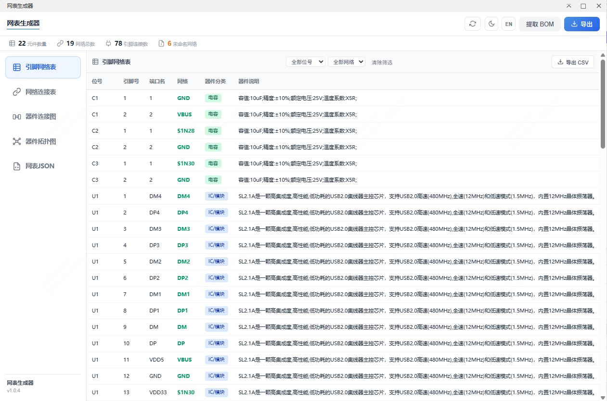
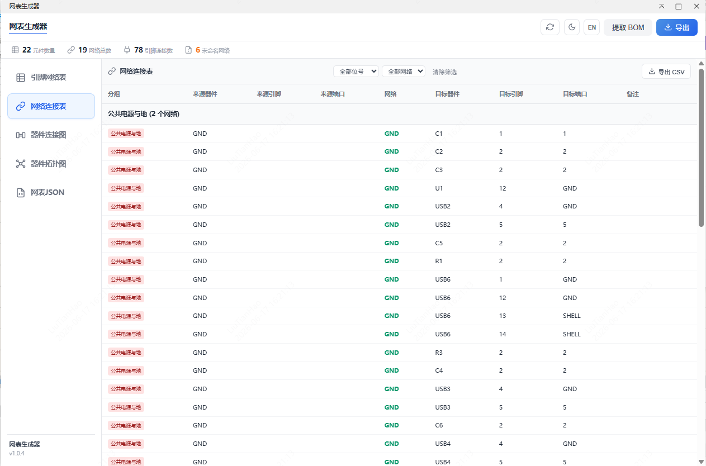
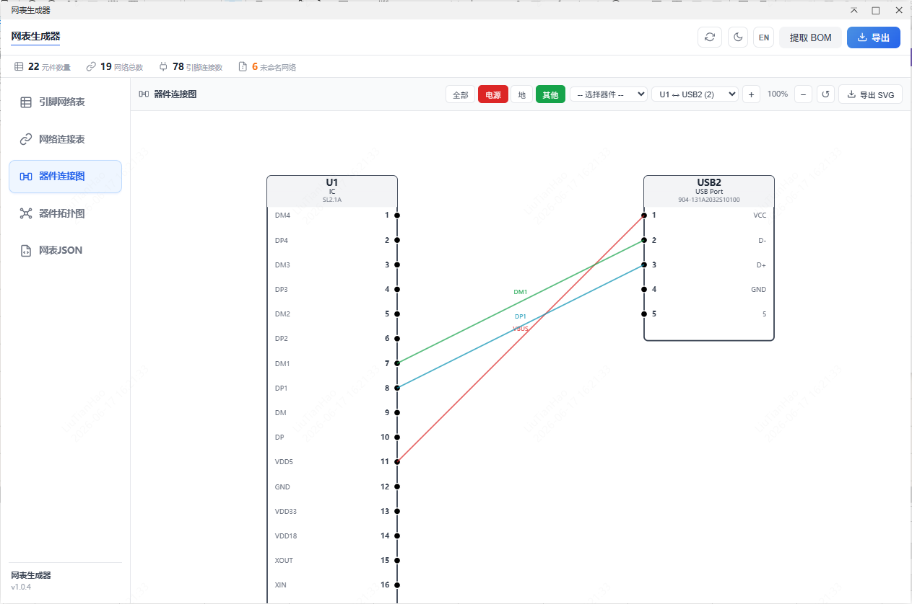
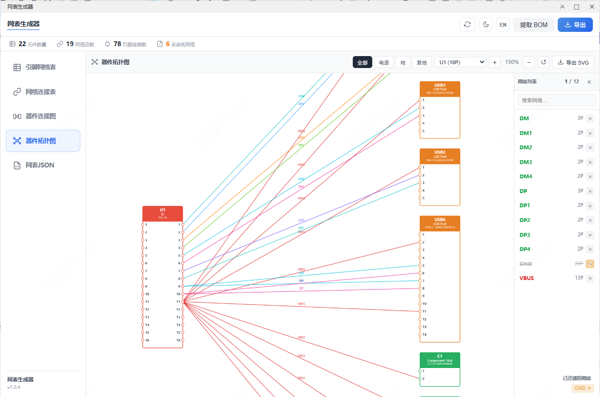
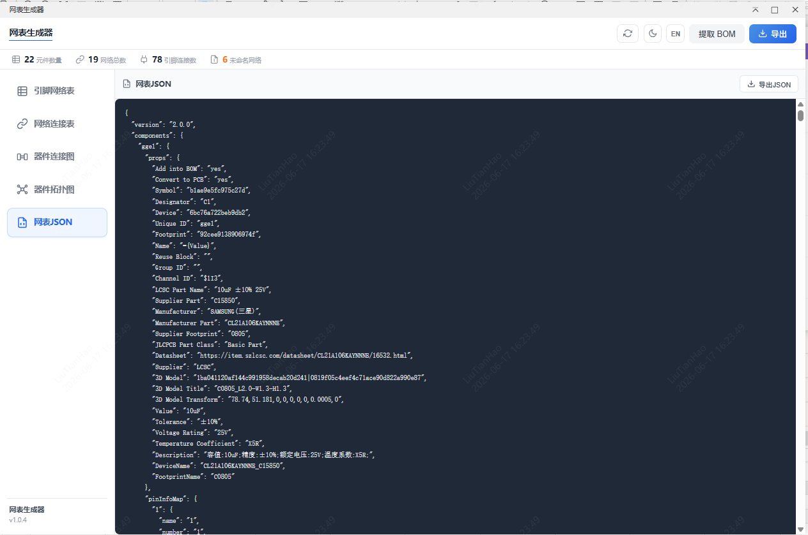
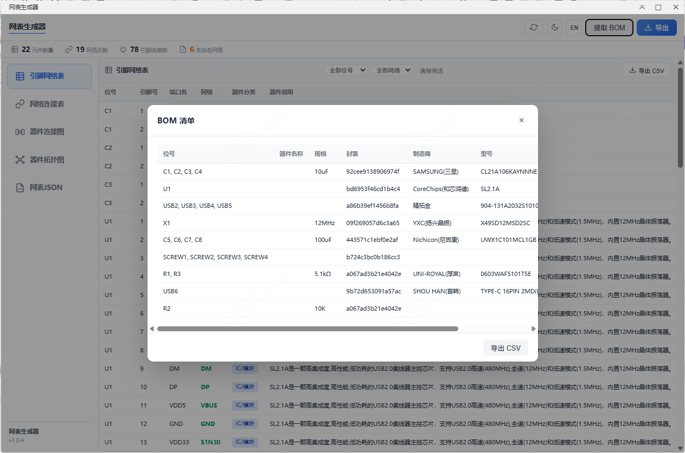

# Netlist Explorer

A netlist analysis tool based on the EasyEDA Pro extension API, supporting one-click netlist extraction from schematics, with netlist browsing, connection analysis, connector pin mapping visualization, BOM extraction, and multi-format export in EasyEDA Pro.

## Supported Views

Supports the following content:
-  Full netlist view

-  Connection reference netlist

-  Connector pin mapping diagram

-  Component topology diagram

-  Raw JSON viewer

-  BOM extraction and export


## In-Editor Capabilities

Useful for:
-  Quickly inspecting all schematic components and pin connections
-  Analyzing grouped net relationships and connection directions
-  Automatically identifying connector pairs and generating pin mapping diagrams
-  Extracting BOM data and exporting CSV
-  Exporting full netlist, connection netlist, and raw JSON

## Features

-  ✨ One-click netlist generation - Extract netlist data directly from the current EasyEDA Pro schematic
-  📊 Statistics dashboard - Display component count, total nets, connected pins, floating pins, and unnamed nets
-  📋 Full netlist view - Browse components, pins, nets, categories, and descriptions in a table
-  🔗 Connection reference netlist - Reorganize raw net connections into a more readable connection table
-  🧭 Connector pair detection - Automatically detect connector-to-connector mapping pairs
-  🖼️ Connection diagram - Generate SVG-based connector pin mapping diagrams with zoom, pan, and filtering
-  🕸️ Component topology diagram - Visualize component connection networks with GND filtered by default, click pins to highlight same-name nets, filter by network
-  🧾 BOM extraction - Aggregate component properties into a BOM list
-  💾 Multi-format export - Export full netlist CSV, connection CSV, raw JSON, and pin mapping SVG
-  🌐 Bilingual UI - Switch between Chinese and English
-  🎨 Theme toggle - Support light and dark themes
-  🔍 Filtering tools - Filter by category, net group, component prefix, and connector pair

## Known Issues

-  Pin name enrichment includes asynchronous enhancement logic, so pin names for some cross-page components may not appear immediately in the initial result
-  For CSV exports containing many special characters, it is recommended to verify formatting in Excel or a text editor
-  The underlying "apply to canvas" message handler is prepared, but the current UI is mainly focused on analysis and export

## Installation

1.  Open EasyEDA Pro
2.  Enter the schematic editor
3.  Click Advanced → Extension Manager → Extension List
4.  Find Netlist Explorer and install it, or click Import Extension
5.  Select the built .eext file
6.  Confirm installation

## Usage

### Open Plugin
In the schematic editor, click the top menu:
Netlist Explorer → Generate Netlist
The plugin window will open automatically and load the current schematic netlist.

### Browse Netlist

After opening the plugin, switch between analysis panels on the left:
-  Full Netlist
-  Connection Reference Netlist
-  Connection Diagram
-  Component Topology Diagram
-  Raw JSON

### Use Filters

In table, mapping, and topology diagram panels, filters can be used to focus on:
-  A specific device category
-  A specific net group
-  A certain connector type
-  A selected pin mapping pair

## Interface Overview

### 1. Top Statistics Bar
Displays:
-  Component count
-  Total net count
-  Connected pin count
-  Floating pins
-  Unnamed nets

### 2. Full Netlist
Displayed as a table:
-  Designator
-  Pin number
-  Pin name
-  Net name
-  Category
-  Description

### 3. Connection Reference Netlist
Reorganizes netlist data into a human-readable connection table, making it easier to inspect:
-  Which device and pin
-  Through which net
-  Connected to which target device and pin

### 4. Connection Diagram
Automatically extracts connector pairs and generates a visual pin mapping diagram with:
-  Zoom
-  Pan
-  Reset to center
-  Pair switching
-  SVG export

### 5. Netlist JSON
Displays the raw netlist JSON extracted from the schematic, useful for debugging, validation, and secondary development.

### 6. Component Topology Diagram
Automatically analyzes component connections and generates a visual topology diagram with:
-  GND networks filtered by default to avoid visual interference
-  Click on a pin to highlight nets with the same name
-  Filter and display by network
-  Interactive zoom and pan
-  SVG export

## Export Options

### Supported Exports
-  Full Netlist CSV
-  Connection CSV
-  Raw JSON
-  Pin Mapping SVG
-  Topology Diagram SVG
-  BOM CSV

### Export Notes
-  Full Netlist CSV: suitable for full connection review and archiving
-  Connection CSV: suitable for interface review and cable checking
-  Raw JSON: suitable for scripting and debugging
-  Pin Mapping SVG: suitable for design notes, interface documentation, or delivery attachments
-  Topology Diagram SVG: suitable for system architecture documentation
-  BOM CSV: suitable for procurement, organization, and archiving

## BOM Extraction

Click Extract BOM to generate a BOM aggregated from component properties.
Extracted fields include:
-  Designators
-  Device name
-  Value / specification
-  Footprint
-  Manufacturer
-  Manufacturer part number
-  Supplier part number
-  Quantity

## Data Source

The plugin mainly retrieves netlist data through EasyEDA Pro's schematic manufacturing data API, then enriches the data by:
-  Pre-filling pin names from netlist JSON
-  Attempting to enhance pin names through the EDA API
-  Supporting pin matching for multi-page schematics
-  Performing extra connector and net classification analysis

## Use Cases

-  Schematic connection inspection
-  Board-level interface checking
-  Connector mapping review
-  Harness definition and organization
-  Design deliverable export
-  Initial BOM extraction and cleanup

## Development

```
npm install
npm run compile
npm run build
```
The built extension package will be generated in the build output directory and can be imported into EasyEDA Pro.

## Tech Stack
-  EasyEDA Pro API - Extension development API
-  TypeScript - Main logic implementation
-  iframe + HTML + CSS + Vanilla JavaScript - UI and interaction
-  SVG - Pin mapping export and rendering

## License
Apache-2.0

## Contributing
Issues and Pull Requests are welcome.

## Links
-  [EasyEDA Pro](https://easyeda.com/)
-  [EasyEDA Pro Extension Development Docs](https://docs.easyeda.com/en/Extension/intro/index.html)
